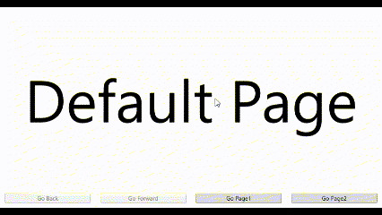
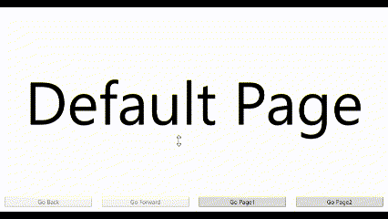

# AnimatedFrame



## 備考

画面遷移時にアニメーションが可能なFrameクラス


## クラスの情報

名前空間 : `EnkuToolkit.Wpf.Controls`<br/>アセンブリ : `EnkuToolkit.Wpf`<br/>xml名前空間 : `https://github.com/StdEnku/EnkuToolkit`


## 使い方

基本的な使用方法は[Frameクラス](https://learn.microsoft.com/ja-jp/dotnet/api/system.windows.controls.frame?view=windowsdesktop-7.0)と同じですが下記のプロパティが追加されており、<br/>
画面遷移時に実行するアニメーションの設定が可能になっています。


| プロパティ名    | 型                | 備考                                                         |
| --------------- | ----------------- | ------------------------------------------------------------ |
| BuiltinAnimType | BuiltinAnimTypes? | 本ライブラリに標準搭載されているアニメーションを使用する際に再生するアニメーションの種類を指定するためのプロパティ。nullを指定するとBackwardAnimプロパティとForwardAnimプロパティで指定したアニメーションが再生されます。本プロパティがnullでBackwardAnimプロパティとForwardAnimプロパティがともにnullの場合アニメーションは実行されません。 |
| ForwardAnim     | Storyboard?       | 次のページへ進める際に実行するStoryboardを指定できるプロパティ。BuiltinAnimTypeプロパティがnullのときのみ有効です。 |
| BackwardAnim    | Storyboard?       | 前のページへ戻る際に実行するStoryboardを指定できるプロパティ。BuiltinAnimTypeプロパティがnullのときのみ有効です。 |

なお現在使用可能なBuiltinAnimTypeは下記の通りです。

- Slidein
- ModernSlidein


## アニメーションの自作例

MainWindow.xamlを下記のように修正してください。

```xaml
<Window x:Class="_00.AnimatedFrame.MainWindow"
        xmlns="http://schemas.microsoft.com/winfx/2006/xaml/presentation"
        xmlns:x="http://schemas.microsoft.com/winfx/2006/xaml"
        xmlns:d="http://schemas.microsoft.com/expression/blend/2008"
        xmlns:mc="http://schemas.openxmlformats.org/markup-compatibility/2006"
        xmlns:local="clr-namespace:_00.AnimatedFrame"
        mc:Ignorable="d"
        xmlns:et="https://github.com/StdEnku/EnkuToolkit"
        Title="MainWindow" Height="450" Width="800">
    
    <DockPanel LastChildFill="True">
        <UniformGrid Columns="4" DockPanel.Dock="Bottom">
            <Button Content="Go Back" Margin="10" Click="GoBack" IsEnabled="{Binding ElementName=MainFrame, Path=CanGoBack}" />
            <Button Content="Go Forward" Margin="10" Click="GoForward" IsEnabled="{Binding ElementName=MainFrame, Path=CanGoForward}" />
            <Button Content="Go Page1" Margin="10" Click="GoPage1" />
            <Button Content="Go Page2" Margin="10" Click="GoPage2" />
        </UniformGrid>

        <et:AnimatedFrame Name="MainFrame"
                          Source="./DefaultPage.xaml"
                          DockPanel.Dock="Top">

            <et:AnimatedFrame.ForwardAnim>
                <Storyboard>
                    <DoubleAnimationUsingKeyFrames BeginTime="0:0:0"
                                       Storyboard.TargetName="CurrentTransform"
                                       Storyboard.TargetProperty="(et:NormalizedTransformContentControl.TranslateY)"
                                       FillBehavior="Stop">

                        <DiscreteDoubleKeyFrame KeyTime="0:0:0" Value="1" />
                        <EasingDoubleKeyFrame KeyTime="0:0:1" Value="0">
                            <EasingDoubleKeyFrame.EasingFunction>
                                <BounceEase EasingMode="EaseOut" />
                            </EasingDoubleKeyFrame.EasingFunction>
                        </EasingDoubleKeyFrame>
                    </DoubleAnimationUsingKeyFrames>

                    <DoubleAnimationUsingKeyFrames BeginTime="0:0:0"
                                       Storyboard.TargetName="OldTransform"
                                       Storyboard.TargetProperty="(et:NormalizedTransformContentControl.TranslateY)"
                                       FillBehavior="Stop">

                        <DiscreteDoubleKeyFrame KeyTime="0:0:0" Value="0" />
                        <EasingDoubleKeyFrame KeyTime="0:0:1" Value="-1">
                            <EasingDoubleKeyFrame.EasingFunction>
                                <BounceEase EasingMode="EaseOut" />
                            </EasingDoubleKeyFrame.EasingFunction>
                        </EasingDoubleKeyFrame>
                    </DoubleAnimationUsingKeyFrames>
                </Storyboard>
            </et:AnimatedFrame.ForwardAnim>

            <et:AnimatedFrame.BackwardAnim>
                <Storyboard>
                    <DoubleAnimationUsingKeyFrames BeginTime="0:0:0"
                                       Storyboard.TargetName="CurrentTransform"
                                       Storyboard.TargetProperty="(et:NormalizedTransformContentControl.TranslateY)"
                                       FillBehavior="Stop">

                        <DiscreteDoubleKeyFrame KeyTime="0:0:0" Value="-1" />
                        <EasingDoubleKeyFrame KeyTime="0:0:1" Value="0">
                            <EasingDoubleKeyFrame.EasingFunction>
                                <BounceEase EasingMode="EaseOut" />
                            </EasingDoubleKeyFrame.EasingFunction>
                        </EasingDoubleKeyFrame>
                    </DoubleAnimationUsingKeyFrames>

                    <DoubleAnimationUsingKeyFrames BeginTime="0:0:0"
                                       Storyboard.TargetName="OldTransform"
                                       Storyboard.TargetProperty="(et:NormalizedTransformContentControl.TranslateY)"
                                       FillBehavior="Stop">

                        <DiscreteDoubleKeyFrame KeyTime="0:0:0" Value="0" />
                        <EasingDoubleKeyFrame KeyTime="0:0:1" Value="1">
                            <EasingDoubleKeyFrame.EasingFunction>
                                <BounceEase EasingMode="EaseOut" />
                            </EasingDoubleKeyFrame.EasingFunction>
                        </EasingDoubleKeyFrame>
                    </DoubleAnimationUsingKeyFrames>
                </Storyboard>
            </et:AnimatedFrame.BackwardAnim>
        </et:AnimatedFrame>
    </DockPanel>
</Window>
```


