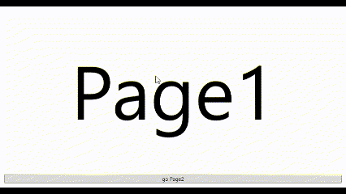
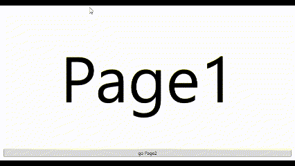

# AnimatedNavigationWindow




## 備考

画面遷移時にアニメーションが可能なNavigationWindowクラス


## クラスの情報

名前空間 : `EnkuToolkit.Wpf.Controls`<br/>アセンブリ : `EnkuToolkit.Wpf`<br/>xml名前空間 : `https://github.com/StdEnku/EnkuToolkit`


## 使い方

基本的な使用方法は[NavigationWindowクラス](https://learn.microsoft.com/ja-jp/dotnet/api/system.windows.navigation.navigationwindow?view=windowsdesktop-7.0)と同じですが下記のプロパティが追加されており、<br/>
画面遷移時に実行するアニメーションの設定が可能になっています。


| プロパティ名    | 型                | 備考                                                         |
| --------------- | ----------------- | ------------------------------------------------------------ |
| BuiltinAnimType | BuiltinAnimTypes? | 本ライブラリに標準搭載されているアニメーションを使用する際に再生するアニメーションの種類を指定するためのプロパティ。nullを指定するとBackwardAnimプロパティとForwardAnimプロパティで指定したアニメーションが再生されます。本プロパティがnullでBackwardAnimプロパティとForwardAnimプロパティがともにnullの場合アニメーションは実行されません。 |
| ForwardAnim     | Storyboard?       | 次のページへ進める際に実行するStoryboardを指定できるプロパティ。BuiltinAnimTypeプロパティがnullのときのみ有効です。 |
| BackwardAnim    | Storyboard?       | 前のページへ戻る際に実行するStoryboardを指定できるプロパティ。BuiltinAnimTypeプロパティがnullのときのみ有効です。 |

なお現在使用可能なBuiltinAnimTypeは下記の通りです。

- Slidein
- ModernSlidein


## アニメーションの自作例

MainWindow.xamlを下記のように修正してください。

```xaml
<et:AnimatedNavigationWindow
    x:Class="_01.AnimatedNavigationWindow.MainWindow"
    xmlns="http://schemas.microsoft.com/winfx/2006/xaml/presentation"
    xmlns:x="http://schemas.microsoft.com/winfx/2006/xaml"
    xmlns:d="http://schemas.microsoft.com/expression/blend/2008"
    xmlns:mc="http://schemas.openxmlformats.org/markup-compatibility/2006"
    xmlns:local="clr-namespace:_01.AnimatedNavigationWindow"
    xmlns:et="https://github.com/StdEnku/EnkuToolkit"
    mc:Ignorable="d"
    Title="MainWindow" Height="450" Width="800"
    Source="Page1.xaml">

    <et:AnimatedNavigationWindow.ForwardAnim>
        <Storyboard>
            <DoubleAnimationUsingKeyFrames BeginTime="0:0:0"
                                       Storyboard.TargetName="CurrentTransform"
                                       Storyboard.TargetProperty="(et:NormalizedTransformContentControl.TranslateY)"
                                       FillBehavior="Stop">

                <DiscreteDoubleKeyFrame KeyTime="0:0:0" Value="1" />
                <EasingDoubleKeyFrame KeyTime="0:0:1" Value="0">
                    <EasingDoubleKeyFrame.EasingFunction>
                        <BounceEase EasingMode="EaseOut" />
                    </EasingDoubleKeyFrame.EasingFunction>
                </EasingDoubleKeyFrame>
            </DoubleAnimationUsingKeyFrames>

            <DoubleAnimationUsingKeyFrames BeginTime="0:0:0"
                                       Storyboard.TargetName="OldTransform"
                                       Storyboard.TargetProperty="(et:NormalizedTransformContentControl.TranslateY)"
                                       FillBehavior="Stop">

                <DiscreteDoubleKeyFrame KeyTime="0:0:0" Value="0" />
                <EasingDoubleKeyFrame KeyTime="0:0:1" Value="-1">
                    <EasingDoubleKeyFrame.EasingFunction>
                        <BounceEase EasingMode="EaseOut" />
                    </EasingDoubleKeyFrame.EasingFunction>
                </EasingDoubleKeyFrame>
            </DoubleAnimationUsingKeyFrames>
        </Storyboard>
    </et:AnimatedNavigationWindow.ForwardAnim>

    <et:AnimatedNavigationWindow.BackwardAnim>
        <Storyboard>
            <DoubleAnimationUsingKeyFrames BeginTime="0:0:0"
                                       Storyboard.TargetName="CurrentTransform"
                                       Storyboard.TargetProperty="(et:NormalizedTransformContentControl.TranslateY)"
                                       FillBehavior="Stop">

                <DiscreteDoubleKeyFrame KeyTime="0:0:0" Value="-1" />
                <EasingDoubleKeyFrame KeyTime="0:0:1" Value="0">
                    <EasingDoubleKeyFrame.EasingFunction>
                        <BounceEase EasingMode="EaseOut" />
                    </EasingDoubleKeyFrame.EasingFunction>
                </EasingDoubleKeyFrame>
            </DoubleAnimationUsingKeyFrames>

            <DoubleAnimationUsingKeyFrames BeginTime="0:0:0"
                                       Storyboard.TargetName="OldTransform"
                                       Storyboard.TargetProperty="(et:NormalizedTransformContentControl.TranslateY)"
                                       FillBehavior="Stop">

                <DiscreteDoubleKeyFrame KeyTime="0:0:0" Value="0" />
                <EasingDoubleKeyFrame KeyTime="0:0:1" Value="1">
                    <EasingDoubleKeyFrame.EasingFunction>
                        <BounceEase EasingMode="EaseOut" />
                    </EasingDoubleKeyFrame.EasingFunction>
                </EasingDoubleKeyFrame>
            </DoubleAnimationUsingKeyFrames>
        </Storyboard>
    </et:AnimatedNavigationWindow.BackwardAnim>
</et:AnimatedNavigationWindow>
```

