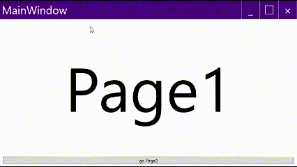

# CustomTitlebarAnimatedNavigationWindow

## 備考

タイトルバーを自由にカスタマイズ可能なAnimatedNavigationWindow

## クラス情報

名前空間 : `EnkuToolkit.Wpf.Controls` アセンブリ : `EnkuToolkit.Wpf` xml名前空間 : `https://github.com/StdEnku/EnkuToolkit`

## 使い方

基本的な使い方は[AnimatedNavigationWindow](../01.AnimatedNavigationWindow/README.md)と同じですが
FrameworkElement型のTitlebarプロパティを持ち、
そこにタイトルバーの内容を書いていきます。
また、タイトルバーのサイズはTitlebarプロパティ内の
オブジェクトのHeightプロパティに依存します。

その他にもウィンドウのサイズ変更で使用する端の幅を指定するための
ResizeBorderThicknessプロパティを持ちます。

注意点 :

> Titlebar内のボタンなどはそのままではウィンドウ移動用の領域と認識されてしまい、
>
> クリック等の操作ができないため対象のボタンなどに
>
> TitlebarComponentsBehavior.IsHitTestVisible添付プロパティを
>
> 添付して、その値にtrueを指定してください。

> 終了処理やWindowState変更処理などはコードビハインドで書いてください。
