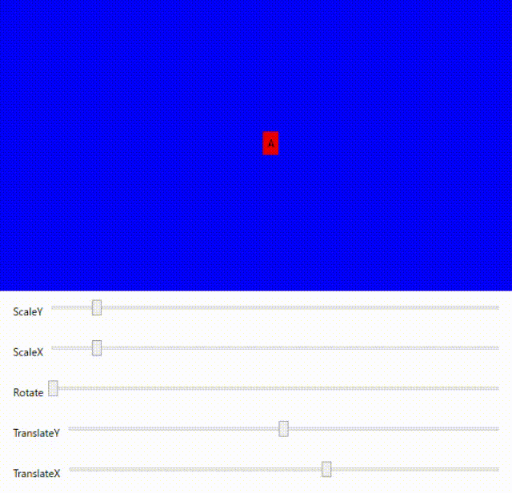

# TransformContentControl

## 備考

移動、変形、拡大、等の変形操作が簡単に行えるContentControl

## クラス情報

名前空間 : `EnkuToolkit.Wpf.Controls` アセンブリ : `EnkuToolkit.Wpf` xml名前空間 : `https://github.com/StdEnku/EnkuToolkit`

## 使い方

移動、回転、拡大、等の変形操作が簡単に実現できるContentControlクラス。

5つの変形用依存関係プロパティを持っているのでそれらを使用して変形させてください。

- TranslateX - 横方向への移動用プロパティ
- TranslateY - 縦方向への移動用プロパティ
- RotateAngle - 0~360を指定可能な回転用プロパティ
- ScaleX - 縦方向のサイズの倍率
- ScaleY - 横方向のサイズの倍率
