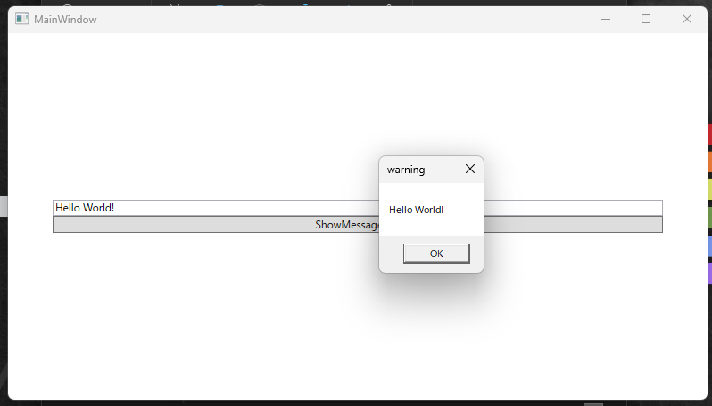

# MessageBoxService

## 備考

メッセージボックスの操作をViewModelから行えるようにするためのViewServce

## クラス情報

### インターフェース側

インターフェース名 : `IMessageBoxService` 名前空間 : `EnkuToolkit.UiIndependent.Services` アセンブリ : `EnkuToolkit.UiIndependent` 

### 実装側

クラス名 : `MessageBoxService` 名前空間 : `EnkuToolkit.Wpf.Behaviors` アセンブリ : `EnkuToolkit.Wpf` 

## 使い方

DIコンテナにIMessageBoxServiceインターフェースとMessageBoxServiceクラスを 登録してViewModelにてコンストラクタインジェクションを使用して 使用することを想定しています。

現在IMessageBoxServiceにて定義されているメソッドは 選択肢のないOKボタンのみのメッセージボックスを表示するためのメソッドである

> void ShowOk(string message, string? title = null);

と

> bool ShowYesNo(string message, string? title = null);

です。

引数のmessageは表示されるメッセージの文字列を指定して、 titleはタイトルとして表示したい文字列を指定してください。

また、ShowYesNoメソッドの戻り値は ユーザーがYesボタンを押したらtrueを返し、 Noを押したらfalseを返します。

