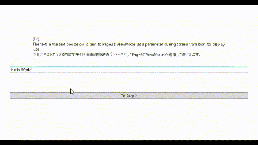

# NavigatedParamSendBehavior



## 備考

FrameやNavigationWindowにて画面遷移を行う際に前の画面から渡されたパラメータをViewModelで取得するためのビヘイビア


## クラスの情報

### ビヘイビア側

名前空間 : `EnkuToolkit.Wpf.Behaviors`<br/>アセンブリ : `EnkuToolkit.Wpf`<br/>xml名前空間 : `https://github.com/StdEnku/EnkuToolkit`

### ViewModel用のインターフェース側

インターフェース名 : INavigatedParamReceive<br/>名前空間 : `EnkuToolkit.UiIndependent.ViewModelInterfaces`<br/>アセンブリ : `EnkuToolkit.UiIndependent`


## 使い方

画面遷移が行われるコントロールがFrameの場合は<br/>そのFrameにNavigatedParamSendBehaviorクラスのIsSendFromFrame添付プロパティを添付して<br/>その値をTrueに指定してください。

> et:NavigatedParamSendBehavior.IsSendFromFrame="True"


画面遷移が行われるコントロールがNavigationWindowの場合は<br/>そのNavigationWindowにNavigatedParamSendBehaviorクラスの<br/>IsSendFromFrame添付プロパティを添付して、その値をTrueに指定してください。

> et:NavigatedParamSendBehavior.IsSendFromNavigationWindow="True"


その後パラメータを取得したいPageのViewModelにINavigatedParamReceiveを継承して<br/>そのViewModelにNavigatedメソッドを実装しましょう。

```c#
~省略~
using EnkuToolkit.UiIndependent.Services;

public class Page2ViewModel : INotifyPropertyChanged, INavigatedParamReceive
{
    ~省略~
    
    // 画面遷移後に実行されるメソッド
    public void Navigated(object? extraData)
    {
        this.MyText = extraData as string ?? string.Empty;
    }
}
```

そのメソッドの引数からパラメータを取得できます。


パラメータの送信側では本ライブラリの[INavigationService](../08.AbstractNavigationService/README.md)の画面遷移系メソッドの引数<br/>extraDataに送信したいデータをセットするか、<br/>Frame/NavigationWindowクラスの[Navigateメソッド](https://learn.microsoft.com/ja-jp/dotnet/api/system.windows.controls.frame.navigate?view=windowsdesktop-7.0#system-windows-controls-frame-navigate(system-uri-system-object))の引数extraDataに<br/>送信したいデータをセットして送信してください。

```c#
public class Page1ViewModel : INotifyPropertyChanged
{
    ~省略~
        
    private readonly INavigationService _navigationService;
    public Page1ViewModel(INavigationService navigationService)
    	=> this._navigationService = navigationService;
    
    // ボタンのクリックで実行されるコマンドなど
    public void ButtonClickedCommand()
    {
        var extraData = "Send Message";
        this._navigationService.NavigateRootBase("Next Page Url", extraData);
    }
}
```

