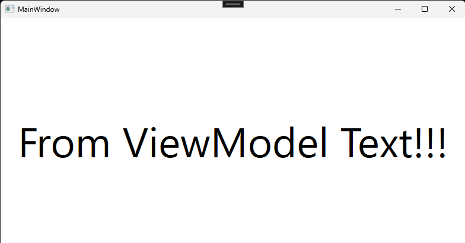

# ViewModelProviderExtension

注意点:本サンプルではEnkuToolkit.Wpfのほかに以下のサードパーティ製ライブラリを使用しています。

- [CommunityToolkit.Mvvm](https://www.nuget.org/packages/CommunityToolkit.Mvvm)
- [Microsoft.Extensions.DependencyInjection](https://www.nuget.org/packages/Microsoft.Extensions.DependencyInjection/8.0.0-preview.1.23110.8)

## 備考
近いうちに書きます。

## クラス情報
近いうちに書きます。

## 使い方
近いうちに書きます。

